# Banco-Bci ::: Registro Usuario y Generacion Token

 


## Prerequisites

* Strong knowledge in development with Java 17, Spring Framework and SpringBoot bootstrap.
* Including an installed version of the JVM (openjdk17) and Maven (3.8.+).

* The project has been developed with the following frameworks:
    - SpringBoot 3.0.1
    - Spring JPA
    - Spring Actuator
    - HSQLDB
    - Java JWT
    - Lombok
    - SpringDOC OpenAPI
    - JUnit 5

## Clone the source

If you want to skip the creation steps you can clone the finished sample (without memcache backed session):

    $ git clone https://github.com/genesiscastillo/evaluacion-bci.git

---
# Run your Application

* To Tests your application simply run:
```bash
mvn test
```

* To build your application simply run:
```bash
mvn clean package install
```

* Similar to the previous approach, it is possible to assign values to properties from the environment
in your `application.properties` file.

```bash
app.security.jwt.secretKey=${APP_SECURITY_JWT_SECRET_KEY:mySecretKey}
app.security.jwt.expirationTime=${APP_SECURITY_JWT_EXPIRATION_TIME:86400} 
```

- Where:
    * __APP_SECURITY_JWT_SECRET_KEY__ -> key name
    * __APP_SECURITY_JWT_EXPIRATION_TIME__ -> expiration time in seconds

* And run your app as follows.

```bash
APP_SECURITY_JWT_SECRET_KEY=secretKey123
APP_SECURITY_JWT_EXPIRATION_TIME=600

java -jar target\app.jar
```

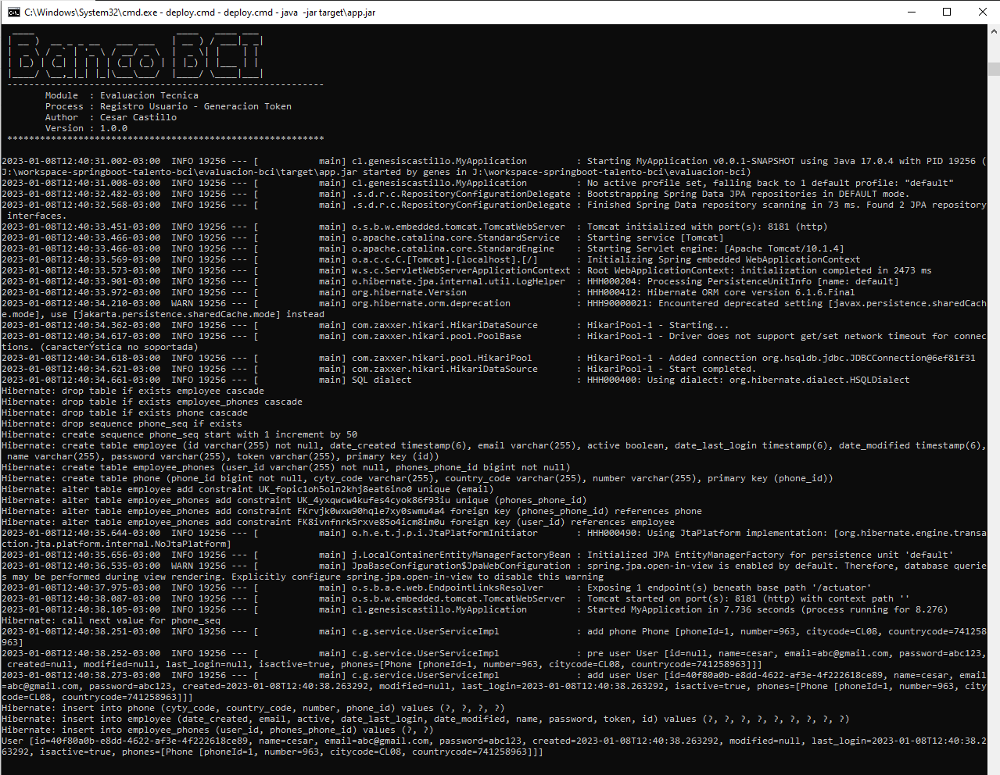


* That's it. Your application should start up on port **8181.**

* test curl : Create User 

    ```bash
    curl --location --request POST 'http://localhost:8181/api/users' \
    --header 'Content-Type: application/json' \
    --data-raw '{
        "name": "Cesar",
        "email": "abc11@gmail.com",
        "password": "abc1234",
        "phones": [
            {
                "number": "741258963",
                "citycode": "963",
                "countrycode": "CL08"
            }
        ]
    }'
    ```

* test curl : Get User by email
    ```bash
    curl --location --request GET 'http://localhost:8181/api/users?email=nfound@gmail.com'
    ```

* test curl: Get All Users
    ```bash
    curl --location --request GET 'http://localhost:8181/api/users/'
    ```

---
## Testing & Evidence

### POST: 

* Creating a User __http://localhost:8181api/users__
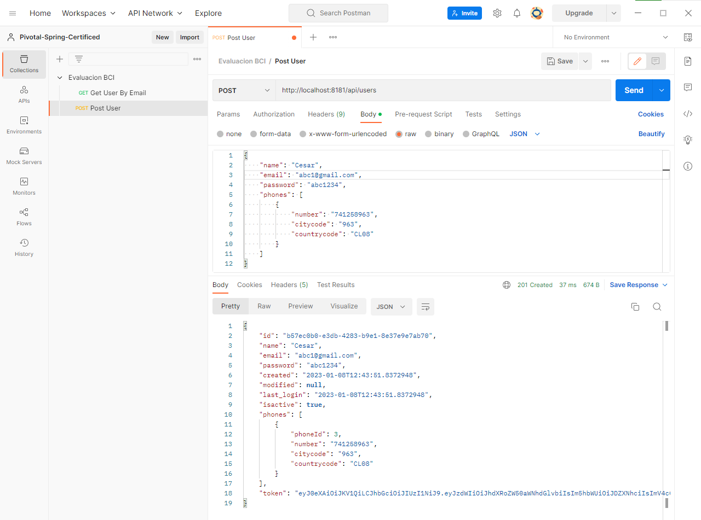

* Conflict in Creation of User __http://localhost:8181api/users__
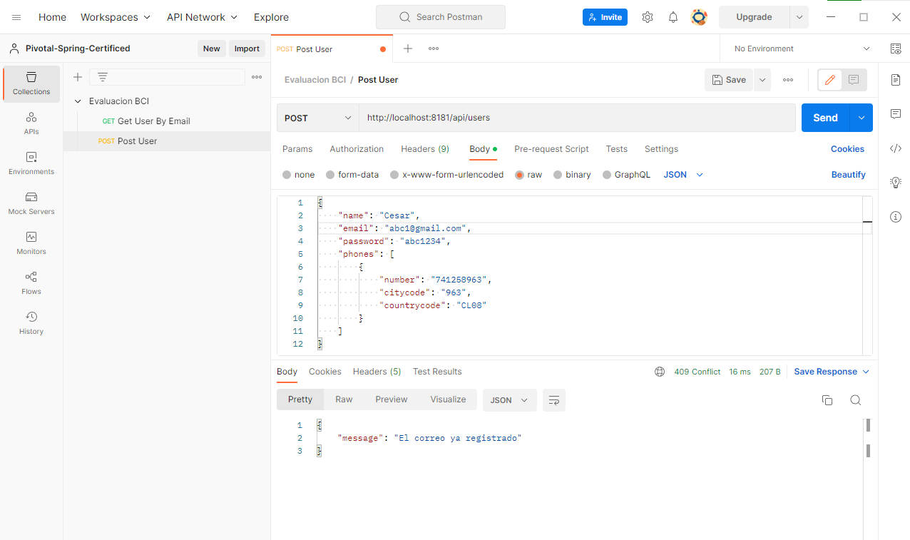

* Error en request __http://localhost:8181api/users__
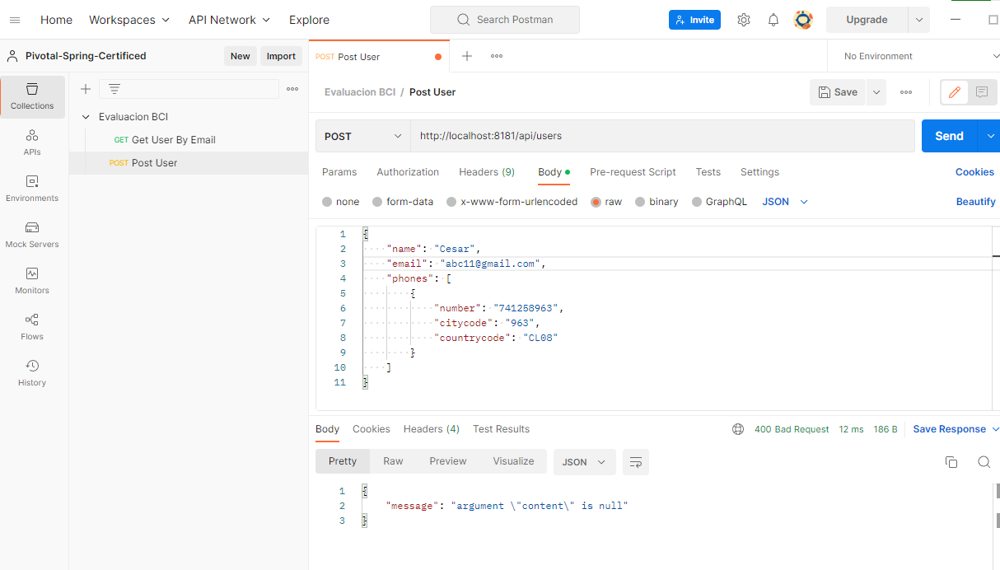

### GET: 

* Get User by email __http://localhost:8181api/users?email=abc@gmail.com__
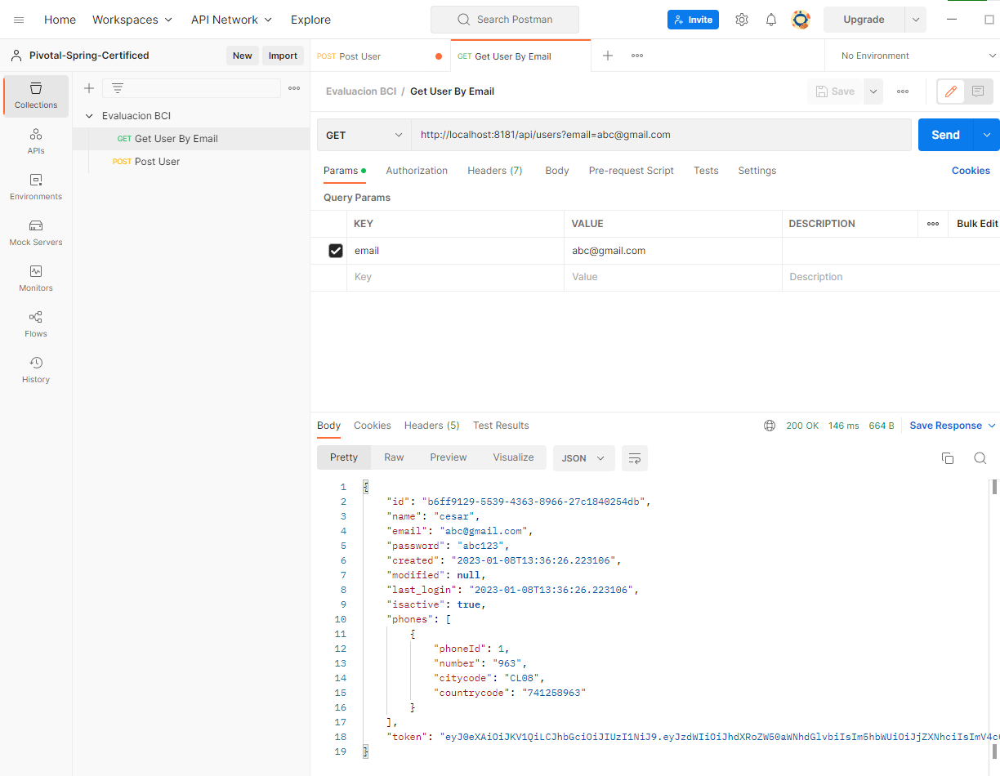

* Get Uset bye email __http://localhost:8181api/users?email=notfound@gmail.com__
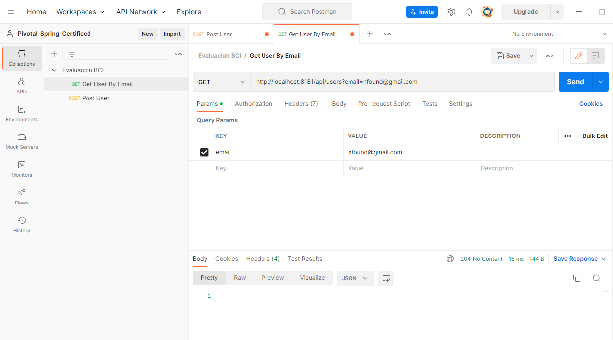

* Get All User __http://localhost:8181api/users/__
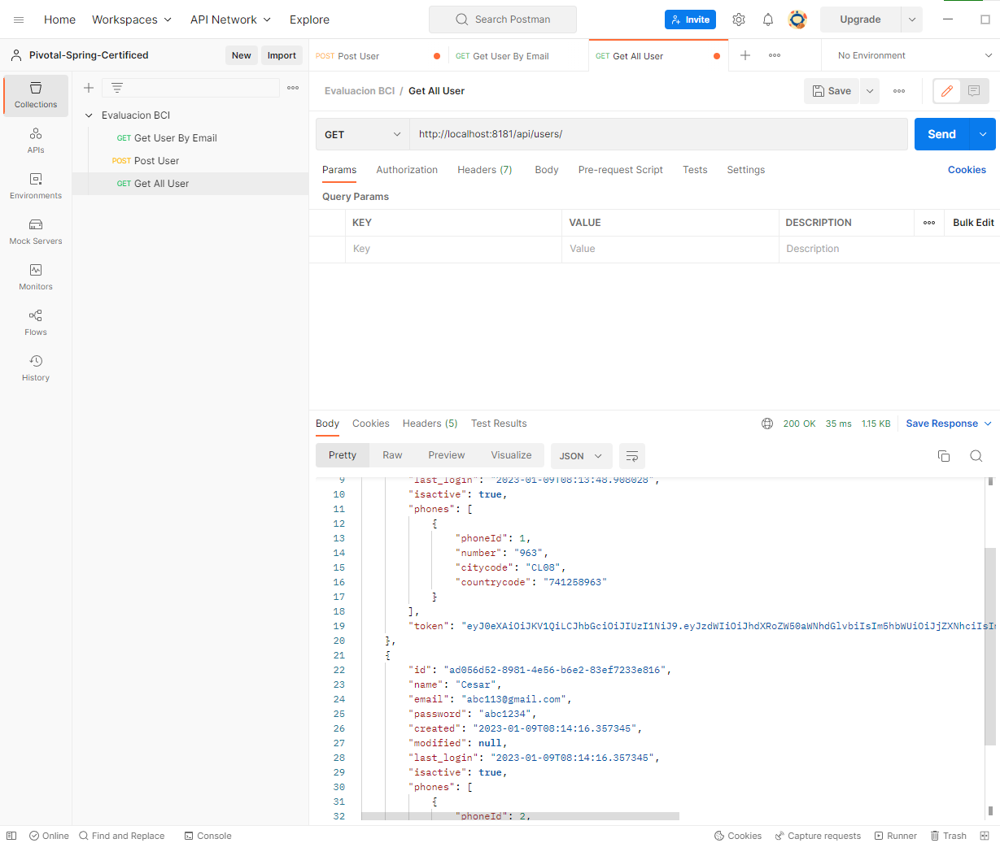

---
# Ethical Hacking

## Diagran Class

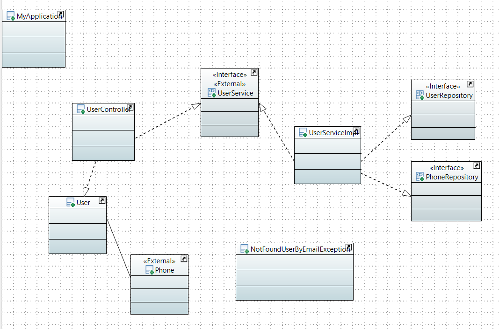

---
## check health app 
```bash
http://localhost:8181/actuator/health
```
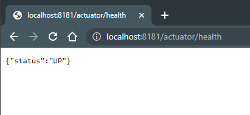

---
## Swagger APIs Specification
```bash
http://localhost:8181/swagger-ui/index.html
```

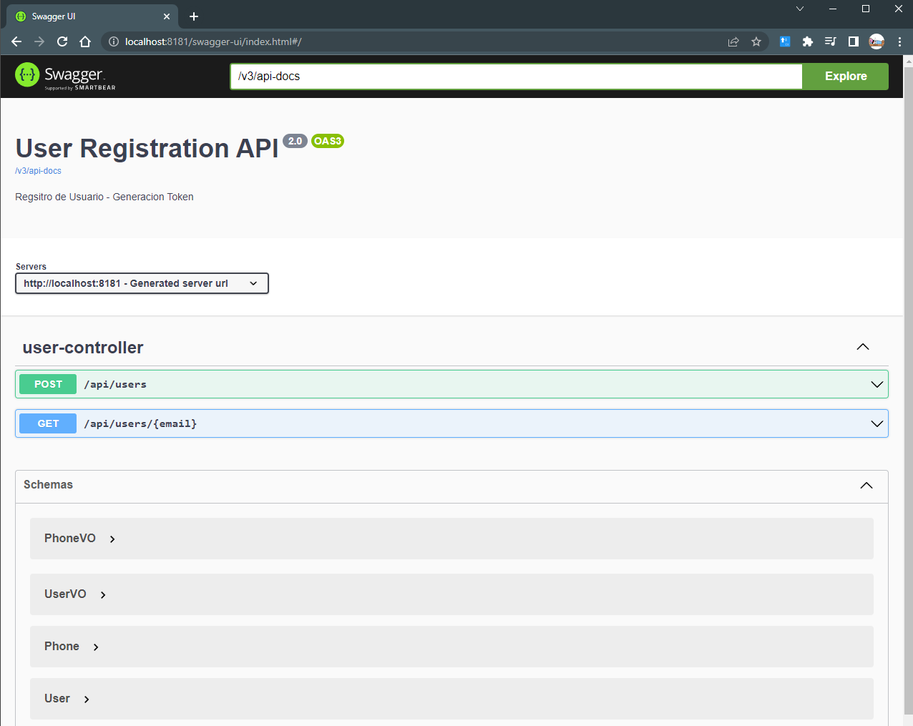

```bash
http://localhost:8181/v3/api-docs
```

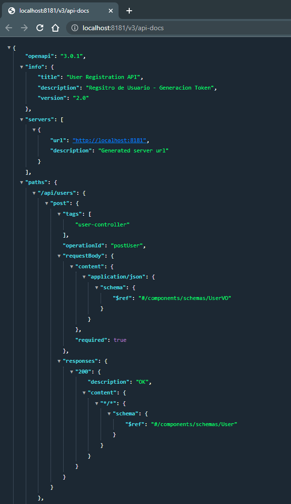

---
## Check vulnerability dependecies

```bash
mvn org.owasp:dependency-check-maven:7.4.4:check
```
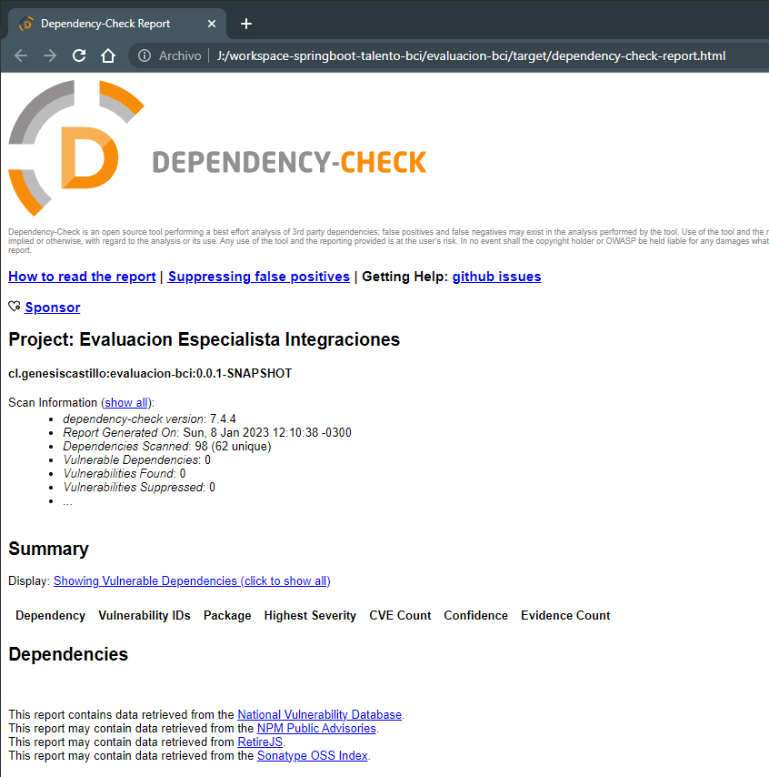

---
## Testing and Coverage Code

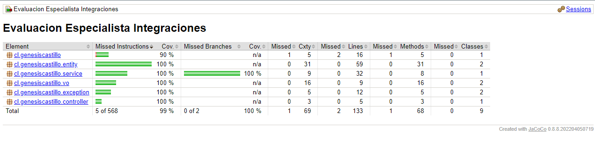

---
## Versions

* 1.0.0 : Evaluacion-Bci

## Authors

* Cesar Castillo : genesiscastillo@hotmail.com