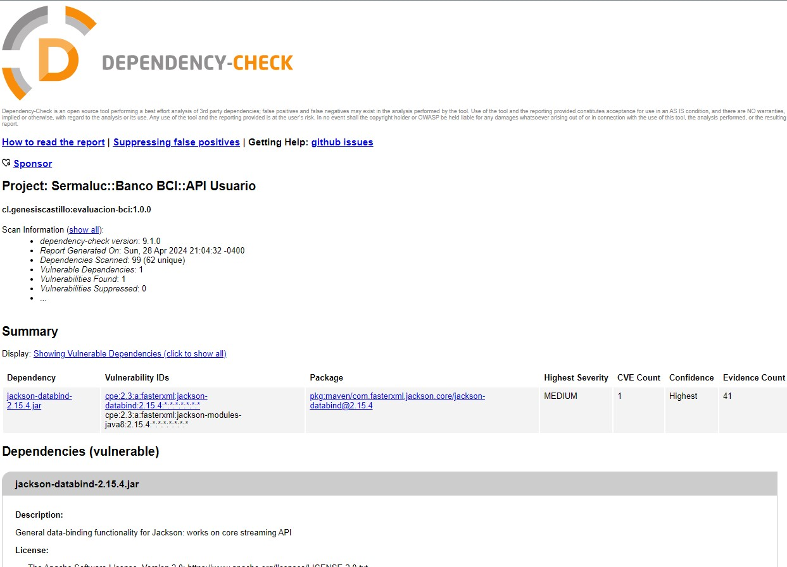

# Banco-Bci ::: Registro Usuario y Generacion Token

 


## Prerequisitos

* Se requiere que el computador tenga instalado los siguientes programas:
	- Una version de JVM (openjdk17) 
	- maven (3.8.+)

* EL proyecto ha sido desarrollado con los siguientes frameworks:
    - SpringBoot
    - Spring JPA
    - Spring Actuator
    - HSQLDB
    - Java JWT
    - Lombok
    - SpringDOC OpenAPI
    - JUnit 5

## Clonar la fuente del proyecto

	$ git clone https://github.com/genesiscastillo/evaluacion-bci.git

---
# Corre su aplicacion

* Para ejecutar la prueba unitaria , ejecute la siguiente manera:

```bash
mvn test
```

* Para ejecutar el jar , aplique lo siguiente

```bash
mvn clean package install
```

* Setear una variable de entorno como la siguinete manera:

```bash
set APP_EXPREG_PASSWORD_USER=^(?=.*[0-9])(?=.*[a-z])(?=.*[A-Z])(?=.*[@#$%^&+=])(?=\\S+$).{8,20}$
```

- donde:
    * __APP_EXPREG_PASSWORD_USER__ -> Expresion regular para el password del usuario.

* Ejecutar la aplicacion

```bash
java -jar target\app.jar
```


* That's it. Your application should start up on port **8181.**


# Despligue la aplicacion con docker

* actualizar la imagen de la aplicacion:

```bash
docker pull genesiscastillo/bci-apiservice-user

docker run -d -p8181:8181 genesiscastillo/bci-apiservice-user
```

* Condiciones para el formato de password del usuario
    - Tener ocho caracteres o más
    - Incluir una letra mayúscula
    - Usar al menos una letra minúscula
    - Consistir en al menos un dígito
    - Necesitar tener un símbolo especial (por ejemplo, @, #, $, %)
    - No contener espacio, tabulación, etc.

* test curl : Create User 

```bash
curl --location 'http://localhost:8181/api/users' \
--header 'Content-Type: application/json' \
--data-raw '{
    "name": "Cesar",
    "email": "genesiscastillo@hotmail.com",
    "password": "Ae#12305",
    "phones": [
            {
                "number": "963296741",
                "citycode": "A",
                "countrycode": "A100256"
            }
    ]
}'
```

* test curl : Get All Users

```bash
curl --location 'http://localhost:8181/api/users'
```

* test curl : Get User by Id

```bash
curl --location 'http://localhost:8181/api/users/0253607c-5f16-4797-ac1d-d1c85beba318'
```

* test curl : Put User by Id

```bash
curl --location --request PUT 'http://localhost:8181/api/users/0253607c-5f16-4797-ac1d-d1c85beba318' \
--header 'Content-Type: application/json' \
--data-raw '{
    "name": "Cesar",
    "email": "genesiscastillo2@hotmail.com",
    "password": "Ae#123058A"


}'
```

* test curl : Delete user by Id

```bash
curl --location --request DELETE 'http://localhost:8181/api/users/0253607c-5f16-4797-ac1d-d1c85beba318'
```
---
## Testing & Evidence

### POST: 

* Creating a User __http://localhost:8181api/users__


* Conflict in Creation of User __http://localhost:8181api/users__


### GET: 

* Get All Users  __http://localhost:8181api/users


* Get User by Id existing __http://localhost:8181api/users/e1902fc8-d0a9-4099-8f16-ee050228d543__


* Get User by Id Not Existed __http://localhost:8181api/users/__


### PUT:

* Put User __http://localhost:8181api/users/e1902fc8-d0a9-4099-8f16-ee050228d543__


* Delete User
__http://localhost:8181api/users/e1902fc8-d0a9-4099-8f16-ee050228d543__


---
# Ethical Hacking

## check health app 
```bash
http://localhost:8181/actuator/health
```


---
## Swagger APIs Specification
```bash
http://localhost:8181/swagger-ui/index.html
```


```bash
http://localhost:8181/v3/api-docs
```

```json
{
    "openapi": "3.0.1",
    "info": {
        "title": "User Registration API",
        "description": "Regsitro de Usuario - Generacion Token",
        "version": "2.0"
    },
    "servers": [
        {
            "url": "http://localhost:8181",
            "description": "Generated server url"
        }
    ],
    "paths": {
        "/api/users/{id}": {
            "get": {
                "tags": [
                    "user-controller"
                ],
                "operationId": "getUserById",
                "parameters": [
                    {
                        "name": "id",
                        "in": "path",
                        "required": true,
                        "schema": {
                            "type": "string"
                        }
                    }
                ],
                "responses": {
                    "200": {
                        "description": "OK",
                        "content": {
                            "*/*": {
                                "schema": {
                                    "$ref": "#/components/schemas/UserResponse"
                                }
                            }
                        }
                    },
                    "409": {
                        "description": "Conflict",
                        "content": {
                            "*/*": {
                                "schema": {
                                    "$ref": "#/components/schemas/ErrorResponseGeneric"
                                }
                            }
                        }
                    },
                    "500": {
                        "description": "Internal Server Error",
                        "content": {
                            "*/*": {
                                "schema": {
                                    "$ref": "#/components/schemas/ErrorResponseGeneric"
                                }
                            }
                        }
                    }
                }
            },
            "put": {
                "tags": [
                    "user-controller"
                ],
                "operationId": "putUser",
                "parameters": [
                    {
                        "name": "id",
                        "in": "path",
                        "required": true,
                        "schema": {
                            "type": "string"
                        }
                    }
                ],
                "requestBody": {
                    "content": {
                        "application/json": {
                            "schema": {
                                "$ref": "#/components/schemas/UserRequest"
                            }
                        }
                    },
                    "required": true
                },
                "responses": {
                    "200": {
                        "description": "OK",
                        "content": {
                            "*/*": {
                                "schema": {
                                    "$ref": "#/components/schemas/UserResponse"
                                }
                            }
                        }
                    },
                    "409": {
                        "description": "Conflict",
                        "content": {
                            "*/*": {
                                "schema": {
                                    "$ref": "#/components/schemas/ErrorResponseGeneric"
                                }
                            }
                        }
                    },
                    "500": {
                        "description": "Internal Server Error",
                        "content": {
                            "*/*": {
                                "schema": {
                                    "$ref": "#/components/schemas/ErrorResponseGeneric"
                                }
                            }
                        }
                    }
                }
            },
            "delete": {
                "tags": [
                    "user-controller"
                ],
                "operationId": "deleteUser",
                "parameters": [
                    {
                        "name": "id",
                        "in": "path",
                        "required": true,
                        "schema": {
                            "type": "string"
                        }
                    }
                ],
                "responses": {
                    "200": {
                        "description": "OK"
                    },
                    "409": {
                        "description": "Conflict",
                        "content": {
                            "*/*": {
                                "schema": {
                                    "$ref": "#/components/schemas/ErrorResponseGeneric"
                                }
                            }
                        }
                    },
                    "500": {
                        "description": "Internal Server Error",
                        "content": {
                            "*/*": {
                                "schema": {
                                    "$ref": "#/components/schemas/ErrorResponseGeneric"
                                }
                            }
                        }
                    }
                }
            }
        },
        "/api/users": {
            "get": {
                "tags": [
                    "user-controller"
                ],
                "operationId": "getUser",
                "responses": {
                    "200": {
                        "description": "OK",
                        "content": {
                            "*/*": {
                                "schema": {
                                    "type": "array",
                                    "items": {
                                        "$ref": "#/components/schemas/User"
                                    }
                                }
                            }
                        }
                    },
                    "409": {
                        "description": "Conflict",
                        "content": {
                            "*/*": {
                                "schema": {
                                    "$ref": "#/components/schemas/ErrorResponseGeneric"
                                }
                            }
                        }
                    },
                    "500": {
                        "description": "Internal Server Error",
                        "content": {
                            "*/*": {
                                "schema": {
                                    "$ref": "#/components/schemas/ErrorResponseGeneric"
                                }
                            }
                        }
                    }
                }
            },
            "post": {
                "tags": [
                    "user-controller"
                ],
                "operationId": "postUser",
                "requestBody": {
                    "content": {
                        "application/json": {
                            "schema": {
                                "$ref": "#/components/schemas/UserRequest"
                            }
                        }
                    },
                    "required": true
                },
                "responses": {
                    "200": {
                        "description": "OK",
                        "content": {
                            "*/*": {
                                "schema": {
                                    "$ref": "#/components/schemas/UserResponse"
                                }
                            }
                        }
                    },
                    "409": {
                        "description": "Conflict",
                        "content": {
                            "*/*": {
                                "schema": {
                                    "$ref": "#/components/schemas/ErrorResponseGeneric"
                                }
                            }
                        }
                    },
                    "500": {
                        "description": "Internal Server Error",
                        "content": {
                            "*/*": {
                                "schema": {
                                    "$ref": "#/components/schemas/ErrorResponseGeneric"
                                }
                            }
                        }
                    }
                }
            }
        }
    },
    "components": {
        "schemas": {
            "ErrorResponseGeneric": {
                "type": "object",
                "properties": {
                    "message": {
                        "type": "string"
                    }
                }
            },
            "PhoneRequest": {
                "required": [
                    "citycode",
                    "countrycode",
                    "number"
                ],
                "type": "object",
                "properties": {
                    "number": {
                        "type": "string"
                    },
                    "citycode": {
                        "type": "string"
                    },
                    "countrycode": {
                        "type": "string"
                    }
                }
            },
            "UserRequest": {
                "required": [
                    "email",
                    "name",
                    "password",
                    "phones"
                ],
                "type": "object",
                "properties": {
                    "name": {
                        "type": "string"
                    },
                    "email": {
                        "type": "string"
                    },
                    "password": {
                        "type": "string"
                    },
                    "phones": {
                        "type": "array",
                        "items": {
                            "$ref": "#/components/schemas/PhoneRequest"
                        }
                    }
                }
            },
            "UserResponse": {
                "type": "object",
                "properties": {
                    "id": {
                        "type": "string"
                    },
                    "created": {
                        "type": "string"
                    },
                    "modified": {
                        "type": "string"
                    },
                    "token": {
                        "type": "string"
                    },
                    "isactive": {
                        "type": "boolean"
                    },
                    "last_login": {
                        "type": "string"
                    }
                }
            },
            "Phone": {
                "type": "object",
                "properties": {
                    "number": {
                        "type": "string"
                    },
                    "citycode": {
                        "type": "string"
                    },
                    "countrycode": {
                        "type": "string"
                    }
                }
            },
            "User": {
                "type": "object",
                "properties": {
                    "id": {
                        "type": "string"
                    },
                    "email": {
                        "type": "string"
                    },
                    "name": {
                        "type": "string",
                        "writeOnly": true
                    },
                    "password": {
                        "type": "string",
                        "writeOnly": true
                    },
                    "created": {
                        "type": "string",
                        "format": "date-time"
                    },
                    "modified": {
                        "type": "string",
                        "format": "date-time"
                    },
                    "lastLogin": {
                        "type": "string",
                        "format": "date-time"
                    },
                    "isactive": {
                        "type": "boolean"
                    },
                    "phones": {
                        "type": "array",
                        "writeOnly": true,
                        "items": {
                            "$ref": "#/components/schemas/Phone"
                        }
                    },
                    "token": {
                        "type": "string"
                    }
                }
            }
        }
    }
}
```

---
## Check vulnerability dependecies

```bash
mvn -DnvdApiKey=faedb08f-9fe1-4406-828f-602dc52700b8 org.owasp:dependency-check-maven:9.1.0:check
```


---
## Testing and Coverage Code


---

## Authors

* Cesar Castillo
* genesiscastillo@hotmail.com